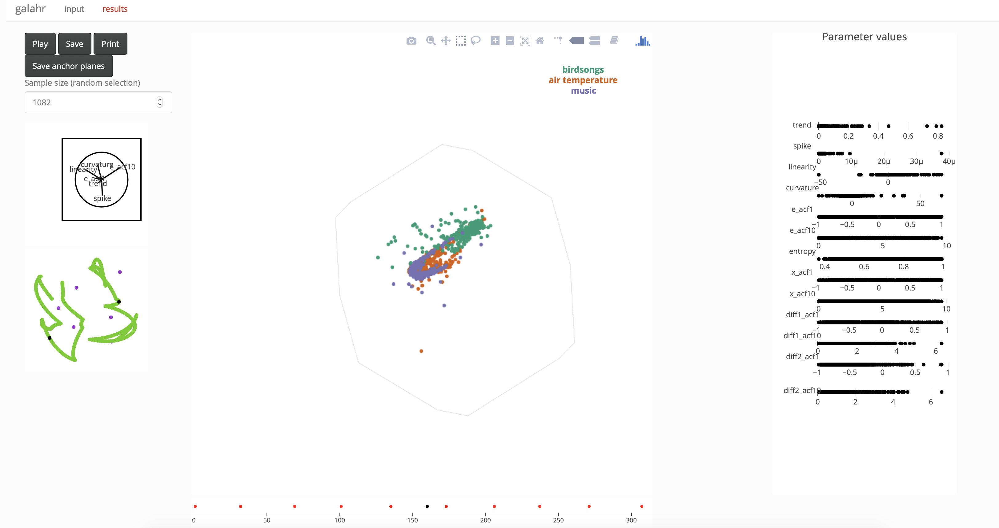
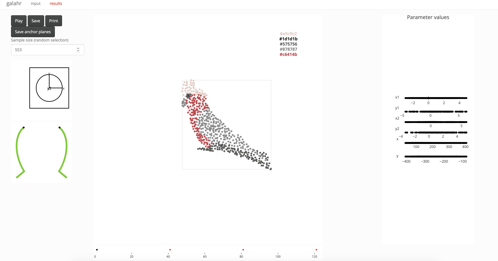
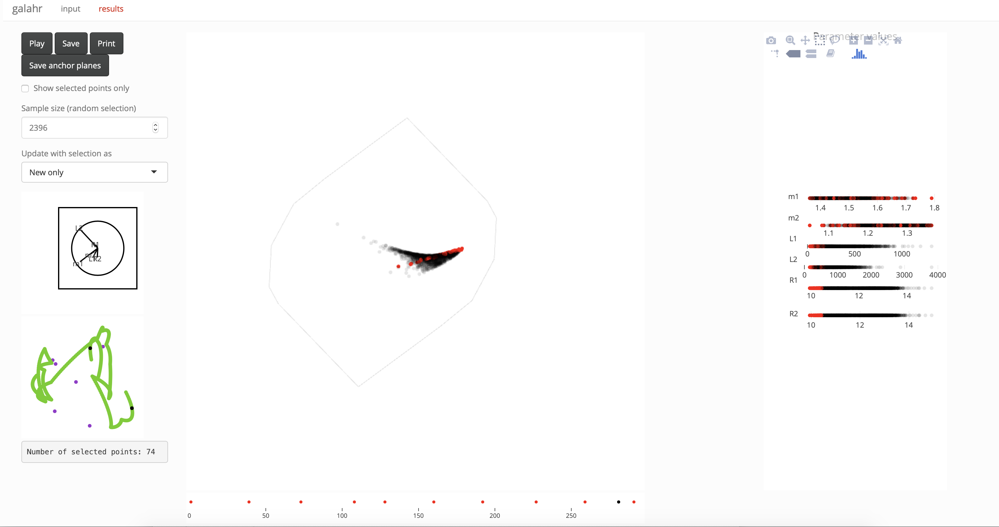
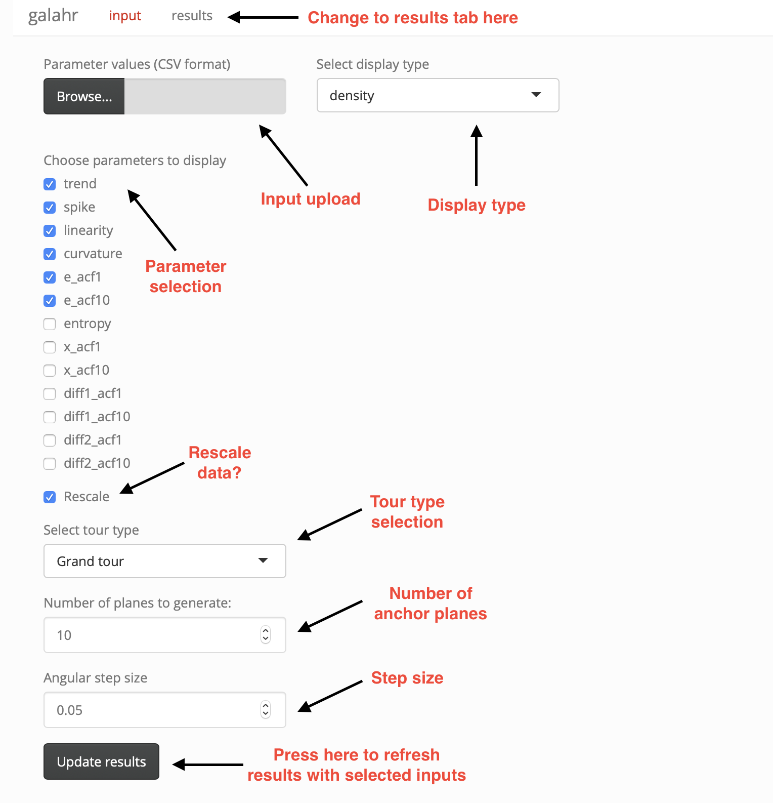
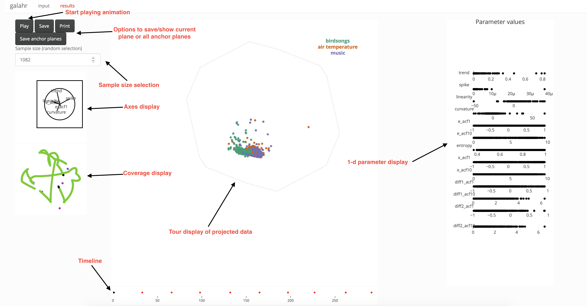

```{r setup, include = FALSE}
knitr::opts_chunk$set(
  collapse = TRUE,
  comment = "#>"
)
```

galahr provides a GUI to the `tourr` package based on `shiny` and `plotly`. Upload your dataset and use the input panel to select settings for the tour and display, move to the results panel to play the tour animation.

## Basic usage

Launch the GUI with the default dataset as

```{r launchApp, eval = FALSE}
launchApp()
```


This will build a Shiny app with some initial default settings, the parameters can then be modified via the graphical interface inside the app. Note that the GUI has two separate tabs, "input"" and "results"", and the "Update results"" action button must be pressed before the results are updated with new input selections. This is because some options may result in long running times before the results can be updated (in particular recording a guided tour).

To look at a different dataset you can either use the file upload in the "input" panel after launching the app, or pass your dataframe in the function call. For example you can launch using the `GW170817` data as

```{r launchAppwData, eval = FALSE}
launchApp(paramDF = GW170817)
```

## Examples

### `tsfeatureData`
By default the `tsfeatureData` dataset is loaded when calling `launchApp()`. This data set contains features (calculated with the `tsfeatures` package) for three types of time series, the type is stored in the `category` variable. By default the app will start up with a grand tour shown in the density display, and up to six variables are selected. You can change the display type as follows

- go to the "input" panel
- in the second column select the "groups" display
- since there is only one categorical variable the grouping variable will be correctly preselected
- push the "update results" button to refresh the "results"
- move to the "results" panel and press "Play" to start the grand tour animation

You should see something like this:
```{r echo=FALSE, out.width='100%'}

```

### `galah`
Another example dataset included with this package is `galah`. Below we explain how to upload a planned tour path with this dataset

- we start by using the spinebil package to generate the planes between which we want to interpolate in the planned tour, you can do this as follows
 ```{r, eval = FALSE}
# matrix representation of planes to show in the planned tour
m1 <- spinebil::basisMatrix(1,2,6)
m2 <- spinebil::basisMatrix(3,4,6)
m3 <- spinebil::basisMatrix(5,6,6)
# store the planes in list format and save as .rds
galahPath <- list(m3, m1, m2, m3)
saveRDS(galahPath, file="galahPath.rds")
  ```
- now lauch the app with the `galah` dataset
 ```{r, eval = FALSE}
 launchApp(galah)
 ```
- select the "groups" display as in the previous example (note that here the categorical variable contains hex codes which are directly mapped to color in the "results" display)
- select the tour type to be "Planned tour"
- this will enable a file upload for the tour path, upload the previously saved "galahPath.rds"
- update the results by pressing "update results"
- move to the "results" panel and hit "Play" to view the planned tour of the dataset

The first view should look like this:

```{r echo=FALSE, out.width='100%'}

```

### `GW170817`

The third dataset included with the package is a posterior sample fitting neutron star parameters to the observed gravitational wave event GW170817.
FIXME paper reference to LIGO here?

- start by loading the app with this dataset:
 ```{r, eval = FALSE}
 launchApp(GW170817)
 ```
- keep the "density" display option which is appropriate for viewing posterior samples
- move to the "results" panel and try different values of "alpha" to tune the transparancy of the sample points
- look at the grand tour of this dataset - do you notice strong association between the parameters?
- move back to the "input" panel to change some of the setting
- try removing m2 from the list of parameters and selecting the tour type "Guided tour"
- you can now choose a projection pursuit index, if you have `mbgraphic` installed, try the "splines2d" index
- press "update results", this will now take about a minute to optimise the index and generate the guided tour path
- move back to the "results" panel to view the animation, moving towards a view showing strong functional dependence
- once you reached the final projection move back to the "input" panel
- select the "Local tour" option to explore the neighborhood of the current projection
- select the display type "linked brushing" and press "update results"
- move back to the "results" panel to play the local tour
- try selecting different regions on the 1-d parameter displays on the right with different options of "Update with selection as"

The example below was made in the linked brushing display, selecting points with low values of R2 on the 1-d display.

```{r echo=FALSE, out.width='100%'}

```

## The `input` panel

The default input options are shown in the annotated image below.

```{r echo=FALSE, out.width='70%'}

```

The following options are available:

| Option | Details |
|:--|:---------|
|   Input update  |  Click "Browse" to upload CSV file of your input data  |
|  Parameter selection  |  Check the parameters that should be included in the tour (at least 3) |
|    Rescale  | Check to rescale each parameter direction to take values between 0 and 1 |
| Tour type | Select from grand tour, guided tour, planned tour, little tour and local tour (starting from the current basis, this is particularly useful when stopping the tour display and loading a local tour to explore the surroundings of an identified interesting view)|
| Step size | Fix the angular step size used in the interpolation between anchor planes |
| Display type | Choose from density, groups and linked brushing |
| Update results | Push button to update results with new input selection |

In addition, some settings allow for new options:

| Option | Details |
|:--|:---------|
| Index function | Choose index function used in the guided tour. The `tourr` functions `holes` and `cmass` are always available. If the `binostics` package is installed the scagnostics indexes "Skinny", "Striated", "Convex" and "Clumpy" are available. If the `mbgraphic` package is installed the index functions "splines2d" and "dcor2d" are available, and if the `minerva` package is installed the index functions "MIC" and "TIC" are available. In addition, if grouping is selected "lda_pp" and "pda_pp" from the `tourr` package are also available.|
| Anchor planes | Upload the anchor planes for a planned tour in RDS format. |
| Grouping variable | Select a grouping variable from all character type input parameters, this is mapped to color in the groups display. |

## The `results` panel

An annotated example of the results display is shown below.

```{r echo=FALSE, out.width='100%'}

```

The following options are available (some depend on display type):

| Option | Details |
|:--|:---------|
| Play | Press to start/pause the tour animation |
| Save/Print| Save (in RDS format) or print the projection matrix for the currently shown projection |
| Save all | Save all anchor planes of the current tour path (in RDS format) |
| Alpha | Select transparancy of points in the density display |
| Update as | Choose how selection for linked brushing is updated (use only new selection, combine both or use only the overlapping region) |
| Selected points only | Only show selected points in the linked brushing display |
| Sample size | Fix a size for a random sample used in the tour display, this may be required for large data sets if rendering becomes slow |

The results are shown in five displays:

| Display | Details |
|:--|:---------|
| Axes display | Visualisation of the currently shown projection matrix. |
| Coverage display | Visualisation of the coverage of the current tour path in the space of all projections based on principal component analysis, anchor points (spanning the basis in p dimensions) are shown in purple, the tour path basis vectors shown in green and the current position shown in black. |
| Tour display | Visualisation of the projected data points in the form of a 2-d scatter plot. In addition we also show a projection of the hypercube containing all data points. |
| Timeline display | Points in red indicate anchor points selected by the tour path generator. The black point shows the current position along the timeline. When the animation is paused clicking on the timeline will result in jumping to the corresponding projection. |
| 1-d parameter display | Visualising the parameter values of all data points, this is most useful when working with the linked brushing option. |

# Thank you

Thanks to Nick Tierney for reviewing this package and giving lots of helpful feedback!
